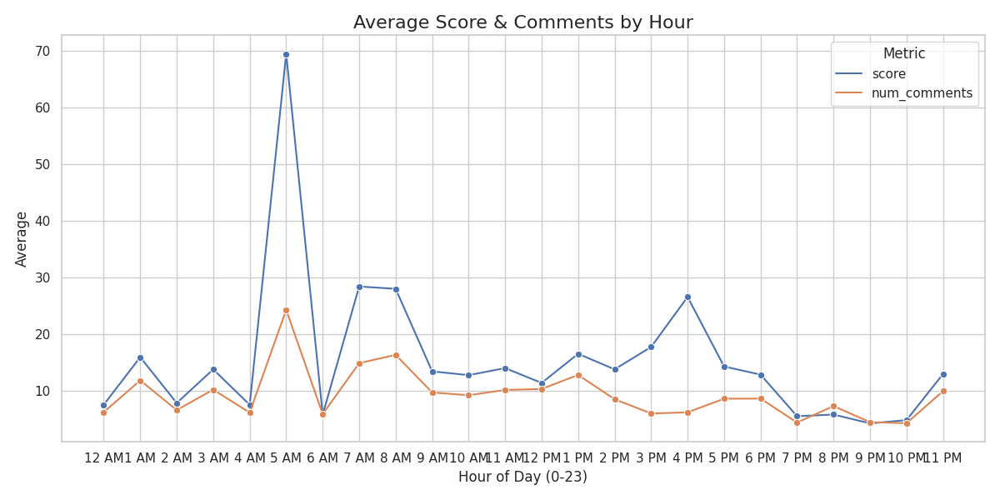
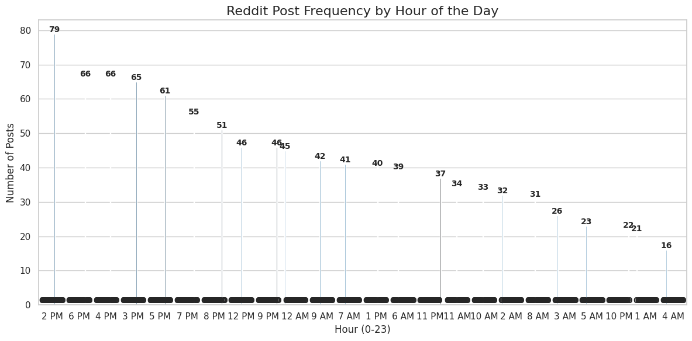
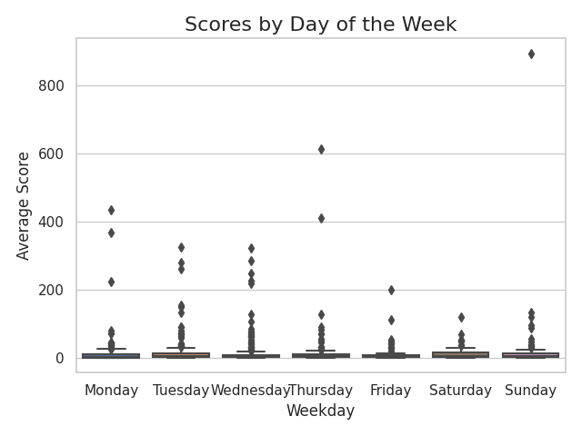
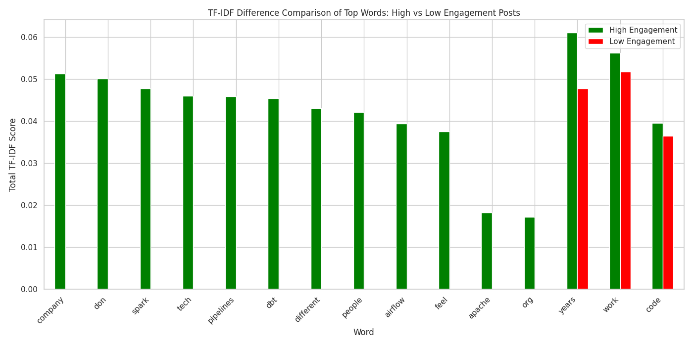
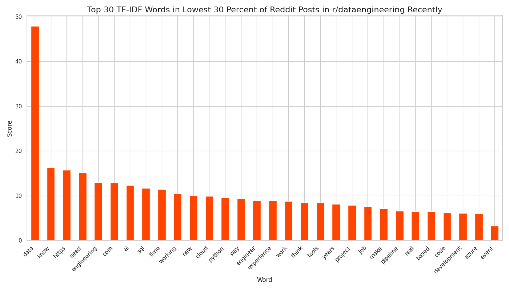
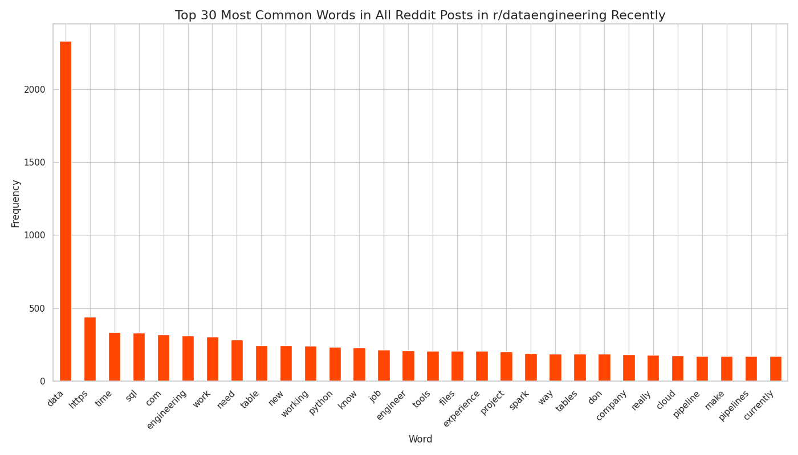

# Reddit Data Engineering Trends Analysis

## TL;DR: What's Trending on r/dataengineering?

This project analyzes Reddit posts from the `r/dataengineering` subreddit to identify trending topics, key engagement drivers, and hidden patterns in community discussions. It leverages NLP, topic modeling, and statistical visualizations to turn daily posts into actionable insights.

---

## Overview

An automated end-to-end pipeline powered by Apache Airflow that:

1. **Ingests** Reddit posts daily using the Python Reddit API Wrapper.
2. **Stores** the data in Amazon S3 and CSV format.
3. **Cleans** and tokenizes post content.
4. **Extracts features** (word count, sentiment, readability score, etc.).
5. **Applies NLP** using Word2Vec and BERTopic for topic clustering.
6. **Visualizes** key drivers of engagement.
7. **Uploads** all processed outputs and charts locally and to Amazon S3.

---

## Tech Stack

**ETL & Scheduling:**
- Apache Airflow
- AWS S3

**Data Storage:**
- CSV, pandas

**NLP & Clustering:**
- Word2Vec (Gensim)
- TF-IDF (sklearn)
- BERTopic
- KMeans + Elbow detection (`kneed`)
- HuggingFace Transformers (DistilBERT)

**Visualization:**
- matplotlib, seaborn, plotly
- scipy (ConvexHull)

---

## Engagement Patterns (Key Insights)

### When to Post

- Posts around **5 AM UTC** show the **highest average scores**, aligning with early morning U.S. hours.
    
- Despite fewer posts early in the day, engagement is stronger, meaning **less competition** for attention.
    
- **Sunday and Thursday** posts have wider engagement ranges (Scores from posts on Sunday and Thursday have a higher distribution)
    

---

### What to Write in Your Post

- Posts between **600–700 words** tend to get the highest engagement.
    
- Shorter posts can go viral too — especially concise tips, rants, or job updates.

---

### Topics That Drive Engagement


- **Cluster 1** (🟧 orange in Word2Vec plot) consistently shows the **highest average score**, **highest word count**, and **highest character count**. This suggests that **longer, more detailed posts drive significantly better engagement**.

- Posts in this cluster commonly contain words like **“working,” “experience,” “job,” anyone,” “company,” and looking**, showing that **career advice, job insights, and personal experiences** might relate most with readers.

- Word clusters with **Databricks, pipelines, Snowflake, Python, AWS, dbt** also yield **higher engagement**.

- Based on the cluster engagement heatmap:

  | Metric              | Cluster 1 Value     | Insight                                 |
  |---------------------|---------------------|------------------------------------------|
  | Average Score       | **12.6**            | Highest engagement among clusters        |
  | Average Word Count  | **174.8**           | Longer posts perform better              |
  | Character Count     | **1074.8**          | More detailed posts = higher scores      |
  | Average Sentiment   | **-0.69**           | Slightly neutral/negative but thoughtful |

- This indicates that:
  - **Thoughtful, authentic storytelling** around personal experience gets noticed.
  - **Descriptive posts** with deeper context (vs. shallow questions) tend to outperform.
  - Posts that aren't strongly opinionated or emotional (but have a slightly negative sentiment) tend to do well.


---

### BERTopic Insights

These charts show the **top topic-word associations** from June 11, 2025:
- **Today** → what’s trending today
    
- **This Week** → weekly topic strength
    
- **Overall** → all-time frequent topics
    

Key topics:  
- Azure certifications (dp-203)
- Databricks, dbt, Spark
- Airflow orchestration
- Microsoft and cloud tools

---

### TF-IDF Signals from High vs Low Engagement Posts

- **High-engagement** words:
  `"spark"`, `"pipelines"`, `"airflow"`, `"company"`, `"dbt"`
    

- **Low-engagement** posts often overuse generic terms:
  `"data"`, `"know"`, `"need"`, `"working"`
    

- **Logged TF-IDF Ratio** confirms tech-specific vocabulary outperforms filler terms.
    

---

### Correlations That Matter

- Score and comments are positively correlated (r=0.55).
- Code or URL presence doesn't necessarily increase score.
- Readability metrics have little effect unless extremely high or low.
    

---

### Most Common Words in r/dataengineering
- High-frequency terms across the subreddit
    

---

## Outputs

- `cluster_engagement_insights.csv`: Topic-level metrics.
- `post_engagement_insights.csv`: Post-level metrics, tags, and engagement labels, along with that post's dominant cluster's metrics as well.
- `.png` graphs for each visualization (saved locally and on S3).

---

## How to Run Locally

1. Clone this repository:
```bash
git clone https://github.com/your-username/reddit-dataengineering-pipeline.git
```

2. Install dependencies:
```bash
pip install -r requirements.txt
```

3. Add credentials for Reddit API and AWS S3 in config\config.conf.

4. Launch Airflow:
```bash
docker-compose up -d
```

5. Trigger the DAG via Airflow UI or CLI.

---

## Author

**Jasjot Parmar**  
Aspiring Data Engineer | Python & SQL Enthusiast | Curious Storyteller  

🔗 [GitHub](https://github.com/jasjotp) • [LinkedIn](https://www.linkedin.com/in/jasjotparmar)

---

## Contact

Feel free to reach out for collaboration, contributions, or just to talk about data!

---